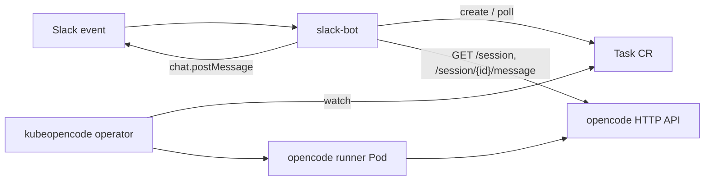

# llm-agent on kubeopencode

The `llm-agent` plugin runs each Slack mention as a Task on the [kubeopencode](https://github.com/kubeopencode/kubeopencode) operator and then fetches the assistant reply from the opencode HTTP API. This document captures only the slack-bot-side conventions and assumptions about the surrounding deployment — the Task CR schema, opencode API, and operator behaviour are documented by kubeopencode and opencode upstream, and are not re-stated here.

## Flow

## Per-Slack-event conventions

For each Slack mention, slack-bot creates one Task with the following slack-bot-specific values:

- **`metadata.name`**: `slack-<sha256(event_id)[:16]>`. The Slack `event_id` is hashed to fit RFC 1123 label limits, and the same event always maps to the same name. Retried Slack deliveries converge on a single Task; `AlreadyExists` (HTTP 409) on create is treated as success.
- **`spec.agentRef.name`**: `slack-bot` (a pre-existing Agent CR; see below).
- **`spec.description`**: the Slack message text with the bot mention stripped, prepended with image-handling hints when attachments are mounted.
- **`spec.contexts`**: the set below.

### Contexts attached to every Task

| `name`                | Kind      | `mountPath`                | Present when                                                                                                                                                                   |
| --------------------- | --------- | -------------------------- | ------------------------------------------------------------------------------------------------------------------------------------------------------------------------------ |
| `slack-channel`       | Text      | `slack-context/channel`    | Always                                                                                                                                                                         |
| `slack-thread-ts`     | Text      | `slack-context/thread-ts`  | Always                                                                                                                                                                         |
| `opencode-session-id` | Text      | `slack-context/session-id` | The Slack thread already has a recorded opencode session (resumed thread)                                                                                                      |
| `slack-images`        | ConfigMap | `slack-images`             | The Slack message has image attachments that fit the per-image / total caps. Mounts at its own root rather than under `slack-context/`, since it's binary, not Slack metadata. |

## Phase ↔ Slack bubble mapping

slack-bot polls each Task it created and updates the Slack thread's assistant-status bubble:

| `status.phase` | Slack-side behaviour                                   |
| -------------- | ------------------------------------------------------ |
| `Pending`      | "Preparing" bubble                                     |
| `Queued`       | "Waiting in queue…" bubble                             |
| `Running`      | "Working on it…" bubble                                |
| `Completed`    | Fetch the opencode reply, post it, clear the bubble    |
| `Failed`       | Post `Task failed: <status.message>`, clear the bubble |
| anything else  | Treated as in-progress; no bubble update               |

slack-bot polls via `list` on a fixed 5 s interval. It has no upper time bound and no per-Task cancellation path, so a Task stuck in a non-terminal phase keeps slack-bot listing the namespace for the lifetime of the slack-bot process. To release a stuck Task, either drive it to `Completed` / `Failed`, or delete the CR — CR disappearance is treated as a give-up signal and slack-bot stops polling that Slack event.

## opencode session title

On the first turn of a Slack thread, slack-bot looks up the opencode session by title, using the Task's `metadata.name` as the lookup key. This relies on the kubeopencode runner setting the opencode session title to the Task's `metadata.name` on first run; without that, slack-bot cannot find the session and falls back to a placeholder message. On later turns slack-bot uses the session id it recorded locally, so the title only matters for first-turn resolution.

## Image ConfigMap

When a Slack message has image attachments, slack-bot creates a ConfigMap in the same namespace before the Task and references it from `spec.contexts`.

- Name: `<task-cr-name>-images`
- Label: `slack-bot.fohte.net/slack-event-id: <event_id>`
- `binaryData` keys: `<NN>-<slack-file-id>.<ext>`, raw bytes base64-encoded
- Caps: ≤ 500 KiB per image and ≤ 700 KiB total before base64 expansion; images over the per-image cap are resized/recompressed to fit (see `image-resizer.ts`), and only dropped if they still don't fit after that (or fail to decode)

slack-bot deletes the ConfigMap on terminal phase and treats `NotFound` as a no-op.

## Pre-existing resources slack-bot expects

| Resource           | Name / location                                        | Notes                                                                                                                                                                                                                                                                                                                                                       |
| ------------------ | ------------------------------------------------------ | ----------------------------------------------------------------------------------------------------------------------------------------------------------------------------------------------------------------------------------------------------------------------------------------------------------------------------------------------------------- |
| Namespace          | `kubeopencode`                                         | Default value; override with the `SLACK_BOT_LLM_AGENT_TASK_CR_NAMESPACE` env variable.                                                                                                                                                                                                                                                                      |
| Agent CR           | `slack-bot` in the namespace above                     | Referenced from every Task via `spec.agentRef.name`. Default name; override with the `SLACK_BOT_LLM_AGENT_TASK_CR_AGENT_NAME` env variable.                                                                                                                                                                                                                 |
| opencode `Service` | `http://slack-bot.kubeopencode.svc.cluster.local:4096` | Fronts opencode's HTTP API at this URL. Default value; override with the `SLACK_BOT_LLM_AGENT_OPENCODE_BASE_URL` env variable. The `slack-bot` host segment is the Service name and is unrelated to the Agent CR above — they share the name by coincidence of the deployment layout. slack-bot retries each call up to 3 times with 1000 ms between tries. |

## RBAC for the slack-bot ServiceAccount

slack-bot authenticates to the API server with its in-cluster ServiceAccount, scoped to the `kubeopencode` namespace:

| API group         | Resource     | Scope      | Verbs              |
| ----------------- | ------------ | ---------- | ------------------ |
| `kubeopencode.io` | `tasks`      | namespaced | `create`, `list`   |
| `""` (core)       | `configmaps` | namespaced | `create`, `delete` |

No cluster-scoped permissions are needed.
